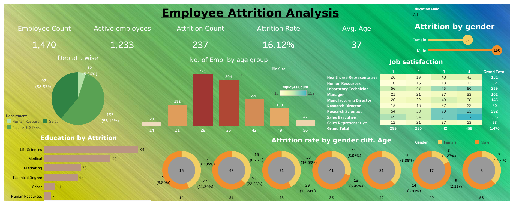

# Employee Attrition Analysis Dashboard 📊

This dashboard provides insights into employee attrition trends across different departments, age groups, job roles, and more.

---

### Key Insights 🔍

1. **Overall Employee and Attrition Counts** 📊  
   - Total employees analyzed: **1,470**
   - Current active employees: **1,233**
   - Total attrition count: **237**, indicating an overall attrition rate of **16.12%**.

2. **Average Employee Age** 📅  
   - The average age of employees is **37 years**, suggesting a mature workforce.

3. **Attrition by Department** 🏢  
   - The **Research & Development** department has the highest attrition, with **56.12%** of all attrition cases, while **Sales** has **38.82%**, and **Human Resources** has **5.06%**.

4. **Attrition by Education Field** 🎓  
   - Employees with a **Life Sciences** background show the highest attrition (89 cases), followed by **Medical** (63 cases) and **Marketing** (35 cases), indicating specific fields may have higher turnover rates.

5. **Attrition by Gender** 🚻  
   - Attrition is higher among **males (150 cases)** compared to **females (87 cases)**, highlighting a gender disparity in employee retention.

6. **Attrition by Age Group** 📈  
   - The age group **28–35 years** has the highest number of employees leaving, suggesting potential challenges in retaining mid-career professionals.

7. **Job Satisfaction Levels** 😊  
   - Employees with high job satisfaction (levels 3 and 4) tend to be retained more, especially in the **Research Scientist** and **Sales Executive** roles, indicating satisfaction may contribute to lower attrition.

8. **Attrition Rate by Gender and Age** 🔍  
   - Detailed breakdown shows that younger employees (around 28 years old) have higher attrition rates, with significant gender differences in retention rates by age.

9. **Role-wise Attrition** 💼  
   - Specific roles like **Sales Executive** and **Research Scientist** show higher job satisfaction and potentially better retention, while some other roles face higher turnover.

10. **Age Bins and Attrition Distribution** 📊  
    - Employees are categorized into **age bins (21-56 years)**, with attrition observed across all bins, but more pronounced in the younger and middle age groups.

---

These insights can help understand trends in employee retention, job satisfaction, and department-specific attrition, offering valuable data for workforce planning and retention strategies.

[View Employee Attrition Analysis Dashboard](https://public.tableau.com/views/HRNewProject/Dashboard1?:language=en-US&:sid=&:redirect=auth&:display_count=n&:origin=viz_share_link)

